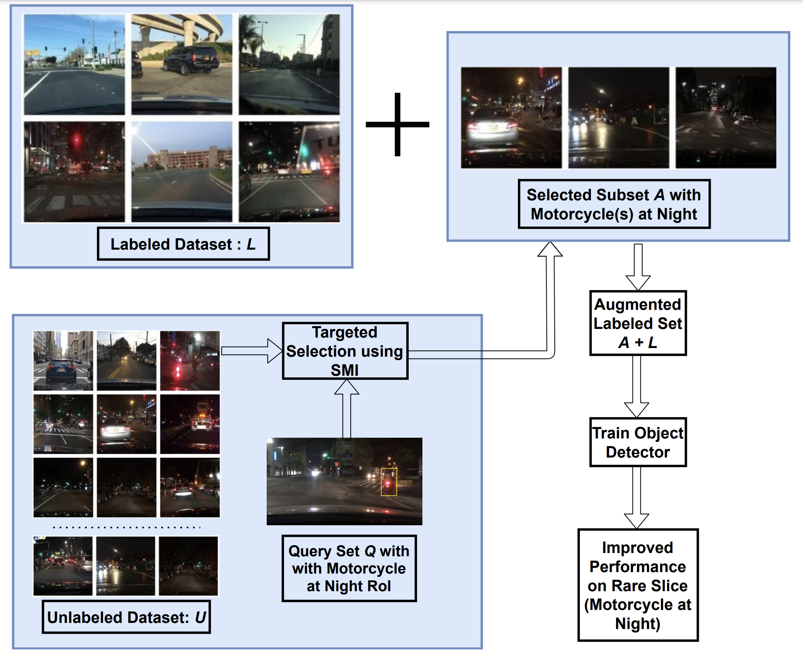
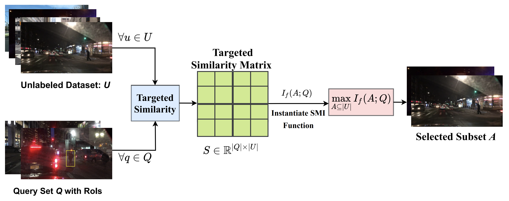
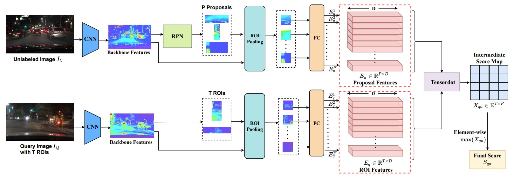
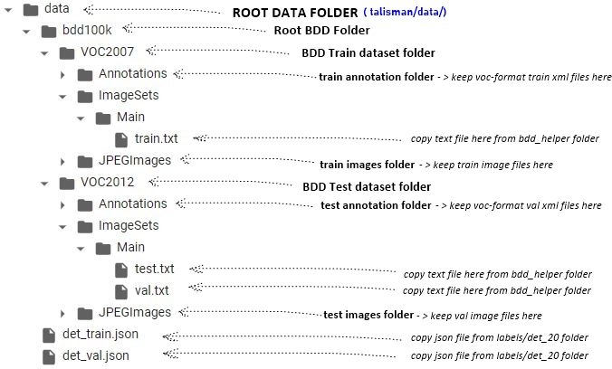

# TALISMAN: Targeted Active Learning for Object Detection with Rare Classes and Slices using Submodular Mutual Information

[](https://opensource.org/licenses/MIT)

Official PyTorch implementation of ECCV 2022 paper ["TALISMAN: Targeted Active Learning for Object Detection with Rare Classes and Slices using Submodular Mutual Information"](https://arxiv.org/ftp/arxiv/papers/2112/2112.00166.pdf).

Suraj Kothawade, Saikat Ghosh, Sumit Shekhar, Yu Xiang, Rishabh Iyer

## Overview

Deep neural networks based object detectors have shown great success in a variety of domains like autonomous vehicles, biomedical imaging, etc. It is known that their success depends on a large amount of data from the domain of interest. While deep models often perform well in terms of overall accuracy, they often struggle in performance on rare yet critical data slices. For example, data slices like "motorcycle at night" or "bicycle at night" are often rare but very critical slices for self-driving applications and false negatives on such rare slices could result in ill-fated failures and accidents. Active learning (AL) is a well-known paradigm to incrementally and adaptively build training datasets with a human in the loop. However, current AL based acquisition functions are not well-equipped to tackle real-world datasets with rare slices, since they are based on uncertainty scores or global descriptors of the image. We propose TALISMAN, a novel framework for Targeted Active Learning or object detectIon with rare slices using Submodular MutuAl iNformation. Our method uses the submodular mutual information functions instantiated using features of the region of interest (RoI) to efficiently target and acquire data points with rare slices. We evaluate our framework on the standard PASCAL VOC07+12 and BDD100K, a real-world self-driving dataset. We observe that TALISMAN outperforms other methods by in terms of average precision on rare slices, and in terms of mAP.

<!---
<a href="url"></a>
-->





<hr>

# Prerequisites
### Install PyTorch
Refer to pytorch official website https://pytorch.org/get-started/locally/

### Install MMCV
```
pip install mmcv-full
```
### Install Submodlib
```
pip install -i https://test.pypi.org/simple/ --extra-index-url https://pypi.org/simple/ submodlib
```

<hr>

# Clone Talisman repo from Github & Install dependencies
```
git clone https://github.com/surajkothawade/talisman.git # clone repository
cd talisman                                              # move inside talisman root directory
mkdir data                                               # create empty data directory
pip install -r requirements/build.txt                    # install build dependency
pip install -r requirements/runtime.txt                  # install runtime dependency
pip install -v -e .                                      # install talisman
```

# Data Preparation
###	Prepare VOC Dataset
##### Download Pascal-VOC 07+12 dataset
```
wget http://pjreddie.com/media/files/VOCtrainval_06-Nov-2007.tar
wget http://pjreddie.com/media/files/VOCtrainval_11-May-2012.tar
wget http://pjreddie.com/media/files/VOCtest_06-Nov-2007.tar
```
##### Unzip compressed dataset inside ‘talisman/data’ folder
```
tar -xvf '<path to VOCtrainval_06-Nov-2007.tar>' -C '<path to talisman/data/>'
tar -xvf '<path to VOCtrainval_11-May-2012.tar>' -C '<path to talisman/data/>'
tar -xvf '<path to VOCtest_06-Nov-2007.tar>'     -C '<path to talisman/data/>'
```
### Prepare BDD Dataset
* Download **100K_images** zip and **Detection_2020** zip from https://bdd-data.berkeley.edu/
* Unzip **bdd100k_images_100k.zip** & **bdd100k_det_20_labels_trainval.zip**
* Convert **det_20/labels/det_train.json** & **det_20/labels/det_val.json** to coco format (Refer to https://doc.bdd100k.com/format.html#to-coco)
* Convert coco annotations to voc format by running below commands in order -
```
pip install imgann
from imgann import Convertor
Convertor.coco2voc('<path to images/100k/train>', '<path to labels/det_20/det_train_coco.json>', '<train_voc annotation output path>', False)
Convertor.coco2voc('<path to images/100k/val>', '<path to labels/det_20/det_val_coco.json>', '<val_voc annotation output path>', False)
```
* Create empty folder structure inside **talisman/data** as below and copy images, label annotations & .txt helper files in respective folders as shown below -



<hr>

# Set Experiment Parameters in scripts inside `talisman/strategies`
#### Set training parameters within the script as per requirement (line 39-46)
*	set `initialTraining = True` if want to create first round model and labelled dataset
*	if first round model and labelled dataset already present, keep `initialTraining = False` which is default
#### Set `config_filename` as per experiment (line 61)
*	Work directory gets created as per the config file name. Hence, this should be unique for each experiment to avoid file and model overwrite.
Example:
```
config_filename = 'faster_rcnn_r50_fpn_AL_voc0712.py'            # VOC - Rare experiment
config_filename = 'faster_rcnn_r50_fpn_AL_bdd100k_mc_rare.py'    # BDD - Rare Motorcycle
config_filename = 'faster_rcnn_r50_fpn_AL_bdd100k_ped_night.py'  # BDD - Pedestrian at night
```
#### Set `split_cfg` parameter (line 128) for rare class imbalance(VOC and BDD) & rare slice imbalance(BDD) as per below table
Parameter |	Experiment |	Dataset |	Meaning
----------|---------|---------|----------
per_imbclass_train | rare class | VOC + BDD	| No. of samples per rare class in the initial training set
per_imbclass_val | rare class | VOC + BDD | Total No. of samples of rare classes in the query set
per_class_train	| rare class | VOC + BDD | No. of samples per unrare class in the initial training set
per_imbclass_train | rare slice | BDD | No. of samples per rare class in the initial seedset which do not belong to rare slice
per_imbclass_attr | rare slice | BDD | No. of samples per rare class in the initial seedset which belongs to rare slice
per_imbclass_val | rare slice | BDD |	Total No. of samples of rare classes in the query set which belongs to rare slice
per_class_train	| rare slice | BDD | No. of samples per unrare class in the initial training set

#### Set `imbalanced_classes` parameter (line 137) for rare class imbalance(VOC and BDD) & rare slice imbalance(BDD) as per below table –

Class Index | VOC Classes | BDD Classes
------------|-------------|------------
0 |aeroplane | pedestrian
1 | bicycle | rider
2 | bird | car
3 | boat | truck
4 | bottle | bus
5 | bus | train
6 | car | motorcycle
7 | cat | bicycle
8 | chair | traffic light
9 | cow | traffic sign
10 | diningtable | N/A
11 | dog | N/A
12 | horse | N/A
13 | motorbike | N/A
14 | person | N/A
15 | pottedplant | N/A
16 | sheep | N/A
17 | sofa | N/A
18 | train | N/A
19 | tvmonitor | N/A

#### Set `rare slice` parameters (line 140-142) only for BDD rare slice experiments
*	set `attr_property` as either of `timeofday` (day/night slice), `weather` (rainy/clear) or `scene` (city streets/highway etc)
*	set `attr_value` as per `attr_property` selected. Example:

attr_property | attr_value
--------------|------------
timeofday | night
weather | rainy
scene | highway

<hr>

# Run Experiments
* For any experiment, run the first strategy with parameter `initialTraining = True` to create first round model and initial labelled seed set
* Once the First Round Training is complete and first round model `Round_1.pth` is available inside `talisman/work_dirs/<config_filename>`, other strategies can be run with parameter `initialTraining = False`.
* Different experiments and different strategies should run with different settings and with different argument list as described in the below table –

Dataset | Experiment | Strategy | Script Name | arg-1 | arg-2 | arg-3 | Sample Command
--------|---------|----------|-------------|-------|-------|-------|----------------
VOC | Rare class | FLMI | smi_VOC.py | <gpu_id> | fl2mi | | python smi_VOC.py 0 fl2mi
VOC | Rare class | GCMI | smi_VOC.py | <gpu_id> | gcmi | | python smi_VOC.py 0 gcmi
BDD | Rare slice | FLMI | smi_BDD.py | <gpu_id> | <file_name>.txt |  fl2mi | python smi_BDD.py 1  ped_night.txt fl2mi
BDD | Rare slice | GCMI | smi_BDD.py | <gpu_id> | <file_name>.txt |  gcmi | python smi_BDD.py 1  ped_night.txt gcmi
